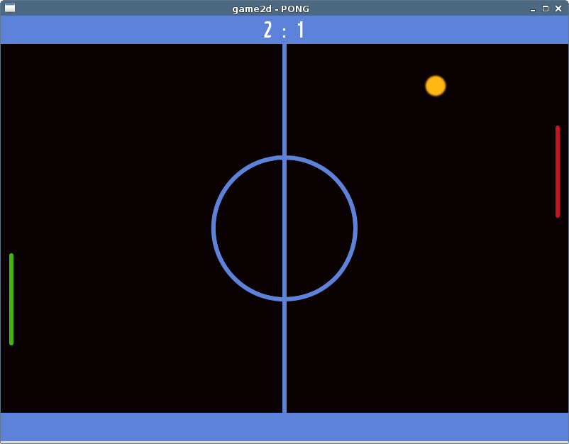

game2d PONG
===========

game2d PONG is a simple game engine demo using SDL2.

The 'scene' based approach makes it easy to implement menus, different levels,
loading screens, etc.

Another advantage of this engine is how the ticks or physical steps work:
Decoupling the game progress from the visual representation of the current
state allows for hardware independant simulation speed so that the game won't
run faster or slower on different machines.

By not doing x ticks per seconds but one tick every x milliseconds we avoid
doing floatig point math which is prone to rounding errors and takes more cpu
time. The result is a (slightly) increased frame rate and cleaner source code.

This project also demonstrates how to do persistent game settings and the
usage of various SDL2 components such as rendering text, playing audio and
using textures.

License
-------
* Code: (c) 2014 Tim Wiederhake, licensed under GPLv3 or later
* Art: Public Domain / CC0, see res/*.txt
